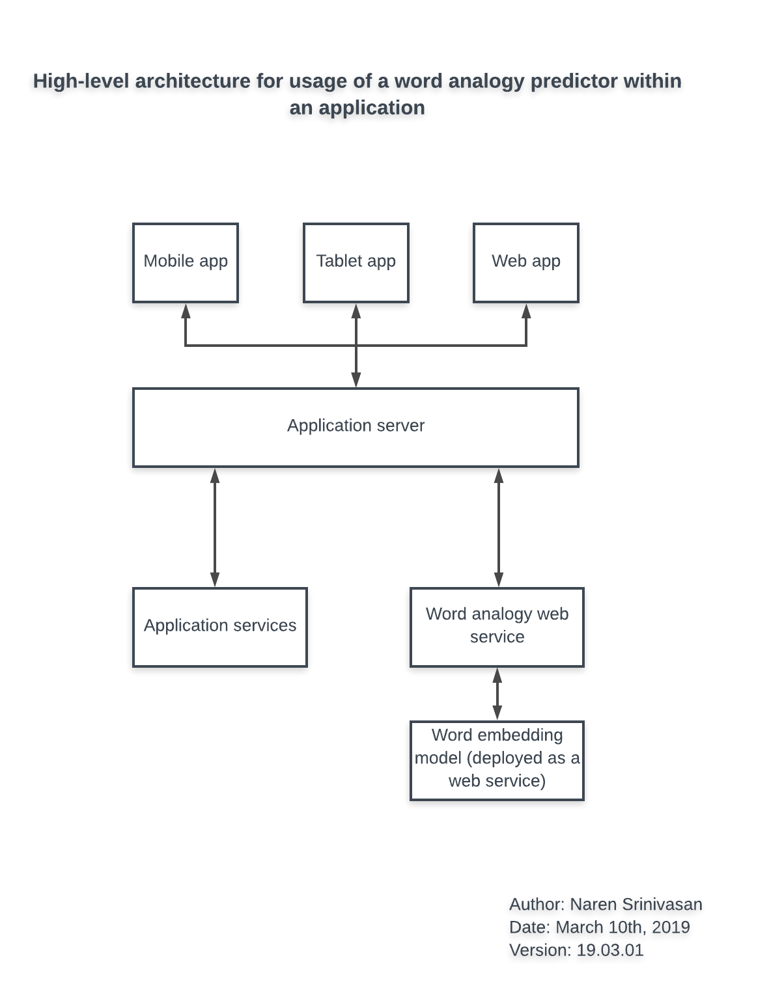

# Word Analogy Predictor

## Objective

A project aimed at predicting the analogy for a word based on an example.

Consider the following examples:

* Man : Woman :: King : ?      | Answer: Queen
* Japan : France :: Tokyo : ?  | Answer: Paris

## Guide for usage
### Folder structure

* **\<root\>**
    * **Predicting_Word_Analogies.ipynb** - The Jupyter Notebook which contains the Python code for this task
    * **Predicting_word_Analogies.html** - This is a rendered version of the Jupyter notebook as a html for the purpose of quick viewing.
* **data**
    * **google_analogy_test_set.txt** - Benchmark dataset for the word analogy task from Google
    * **google_analogy_test_set_with_predictions.csv** - A file with the predictions from the above code on the Google Analogy test set
* **embeddings** - This folder should contain the word embeddings file required to perform the word analogy task. See *Dependencies* below.
* **img** - Contains the architecture diagram for the system

### Dependencies

* **Modules** - The following Python modules are required to execute the Jupyter notebook:
    * *numpy*
    * *pandas*
    * *scikit-learn*
    * *gensim*

* **Pre-trained word embeddings** -

    * Pre-trained word embedding files are required to obtain the word analogy. In this project *fastText* word embeddings have been used. These cannot be committed to the Git repository due to their large size (zip file is ~ 600 MB). The embeddings can be downloaded from the following link: https://fasttext.cc/docs/en/english-vectors.html
    * The zip needs to be extracted and the *.vec* file placed in the embedding folder. The name needs to be changed in the Jupyter notebook according to the file name, when reading it into memory.

### Usage

* To quickly view the results, please open the **Predicting_word_Analogies.html** file which has the rendered version of the Jupyter notebook, with a few examples of the word analogy task run.
* To view the code, and execute step by step, please use the **Predicting_word_Analogies.ipynb** file.
* In order make predictions for specific queries, that you would like to input, code chunks pertaining to loading of the model, as well as word analogy predictions need to be run. Of course, this is after downloading the relevant word embedding file and extracting it in the **embedding** folder

## Methodology for word analogy predictions

* Word analogies can be predicted using **word embeddings**. **Word embeddings** are high dimensional numeric representations of the word according to the context in which it is typically used. 
* The distance between the embedding vectors of 2 words are indicative of the difference in typical usage of the words.
* Analogies based on an example can be predicted using these word embeddings and by calculating the cosine similarity between words
* Conceptually, this loosely translates to finding a word, which has a similar distance from the *query* word as the distance between the *example* words. This would mean that the *answer* word has approximately the same level of similarity to the *query* word, as the level of similarity between the *example* words. As these are done on word embeddings which capture of the context of a word's typical usage, this translates to identifying analogies. [In terms of one of the examples quoted above, 'King' is the *query* word, & 'man' and 'woman' are the example words. 'Queen' is the *answer* ]
* There are several pretrained embedding models available trained on huge corpora. *fastText* has been used in this project
* Word embedding models can also be trained over pre-trained models for a specifialized context, but this requires a huge amount of data

## Results

* Using this approach, **87.6 %** of word analogy queries in the Google Analogy test set (which is a standard benchmark for this task) were correctly predicted

## Further scope

* There various pre-trained embeddings available, with various variants of the each. These can be used in order to improve accuracy, or use a specialized embedding for a specific context. Other embeddings include:
    ** GloVe
    ** ELMo
    ** word2vec

## High-level architecture for the system

* The above high-level architecture provides an indication to make the word analogy predictor available to be used as part of a larger system/ application
* The crux of the approach is to wrap the **Word embedding** model in a web service which can be directly queried (through requests). The Web Service API should expose the functions available on the word embedding model
* Secondly, the Word analogy predictor is itself exposed as a web service - In this way, asynchronous requests can be made to obtain word analogies for specific queries.
* According to the expected number of requests per second, the infrastructure for the Word analogy and Word Embedding model services need to be scaled.

